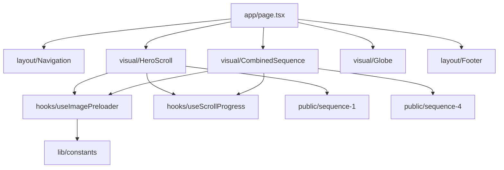

# Jesko Jets - Luxury Aviation Landing Page

A cinematic, high-performance landing page concept for a private jet company. This project demonstrates advanced frontend storytelling through scroll-sequenced animations and smooth-scrolling mechanics.

---

## 🏗️ Technical Design Record (TDR)

### The Challenge
Creating a "wow" factor often involves heavy video files that lead to slow load times and stuttering animations. This project explores an alternative: **Scroll-Triggered Image Sequences**.

### The Solution: Canvas-Based Rendering
Instead of using `<video>` tags, the core animations (The Hero jet and the Flight sequence) are rendered using an optimized **HTML5 Canvas** pipeline:
- **Preloading Engine**: A custom `useImagePreloader` hook caches large sequences of JPG frames in browser memory before the animation starts.
- **Scroll Mapping**: Using `framer-motion`, scroll progress is mapped directly to frame indices.
- **High Frame Rate**: Since the canvas draws directly from memory based on pixel-perfect scroll position, the result is "silk-smooth" 60fps interaction regardless of scroll speed.

### Performance Stack
- **Lenis Scroll**: Provides the weight and inertia needed to make the scroll sequences feel premium.
- **Framer Motion**: Handles all UI transitions, text overlays, and orchestrates the canvas opacity/scale changes.
- **Three.js (Concept)**: The 3D Globe component provides a visual anchor for global reach storytelling.

---

## 🛠️ Architecture Overview



## 📁 Repository Structure

- `app/`: Next.js 14 App Router configuration and main page.
- `components/`:
  - `layout/`: Foundational UI components (Nav, Footer).
  - `visual/`: High-intelligence animation components (Canvas, Globe).
  - `ui/`: Reusable atomic elements (Buttons, Inputs).
- `hooks/`: Custom React hooks for sequence preloading and scroll tracking.
- `lib/`: Centralized copy, constants, and utility functions.
- `public/`: High-resolution asset sequences categorized by scene.

---

## 🚀 Getting Started

1. **Clone & Install**:
   ```bash
   git clone https://github.com/karthikeyachalla/jesko-jets-landing-page.git
   cd jesko-jets-landing-page
   npm install
   ```

2. **Development**:
   ```bash
   npm run dev
   ```

3. **Build**:
   ```bash
   npm run build
   ```

## 📄 License

This project is open-source and available under the [MIT License](LICENSE).

---
> [!NOTE]
> This is a learning project inspired by award-winning interactive designs (e.g., Awwwards). All flight assets are used for educational/demonstration purposes.
